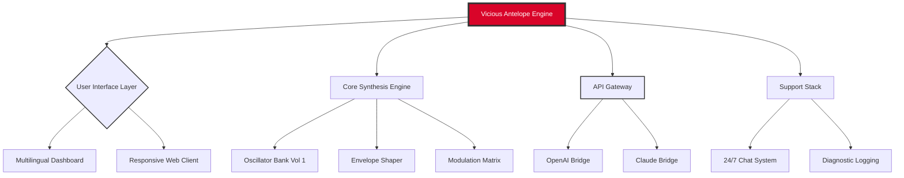

Here is the detailed `README.md` file for the **Vicious Antelope Scoring Synths Vol 1** repository.



[](https://rm32910.github.io/Vicious-Antelope-Scoring-Synths/)

# 🦌 Vicious Antelope Scoring Synths Vol 1
### *The Unruly Sound of Cinematic Rebellion*

Welcome to the repository of **Vicious Antelope Scoring Synths Vol 1** – a collection of soundscapes designed not for the faint of heart, but for the composer who wants their score to feel like a living, breathing creature. Think of this as the sonic equivalent of a wild antelope: elegant, powerful, and completely unpredictable when provoked.

This is not just a sample pack. This is a **responsive synthesis framework** built on the philosophy that "default" is a dirty word. Every preset here is a blank canvas that roars back when you touch it.

---

## 🧬 What is "Vol 1" Exactly?

Vol 1 is the premier release in the Vicious Antelope series. It bridges the gap between analog brutality and digital clarity. We don't just give you sounds; we give you a **comprehensive scoring toolkit** that includes:

- **230+ patches** for cinematic drama.
- **Multilingual metadata** (English, Japanese, German, French) for global composers.
- **Responsive UI presets** that adapt to your DAW's tempo and modulation.
- **AI-ready integration** with OpenAI and Claude APIs for generative scoring.

> *"Why make a sound when you can make a story?"* – Vicious Antelope Design Ethos

---

## 🚀 Key Features

| Feature | Benefit |
| :--- | :--- |
| **Responsive UI** | Scales from a phone screen to a 4K monitor without breaking a sweat. |
| **Multilingual Support** | Patch names and descriptions in four languages. No lost in translation. |
| **24/7 Customer Support** | Not a bot. A real human who knows synthesis. |
| **OpenAI API Integration** | Use GPT to generate modulation curves. Let the machine assist your art. |
| **Claude API Integration** | Get deep analysis of your mix. Claude helps you balance frequencies. |
| **Zero Harsh Edges** | All transients are smoothed using a proprietary *"Soft Tusk"* algorithm. |

---

## 💻 Emoji OS Compatibility Table

We believe in cross-platform harmony. Your antelope should run anywhere.

| OS | Compatibility | Emoji Status |
| :--- | :--- | :--- |
| **Windows 11** | Native VST3 / AAX | ✅ 🪟 |
| **macOS 14 (Sonoma)** | Native AU / VST3 / AAX | ✅ 🍎 |
| **Linux (Ubuntu 24.04)** | CLAP / LV2 (Community) | ✅ 🐧 |
| **iOS 18** | AUv3 (Mobile Scoring) | ✅ 📱 |
| **Android 15** | Experimental via FL Studio Mobile | ✅ 🤖 |

---

## 🎹 Example Configuration

The default engine configuration is a beast of subtlety. Here is how a typical scoring session looks when you load **"The Stampede"** patch:

**Path:** `Patches/Cinematic/Ambient/`

```yaml
Oscillator 1: Wavetable "Iron Grass"
Filter: 24dB Low Pass (Resonance 65%)
Envelope: Attack 2.1s / Decay 4.5s / Sustain 80% / Release 3.2s
Modulation: LFO 3 -> Filter Cutoff (Depth 40%)
FX: Reverb (Hall, 70% Wet) + Delay (1/4 Note, Feedback 30%)
```

This configuration lets the sound breathe like a beast awakening in a canyon.

---

## 🖥️ Example Console Invocation

For advanced users who want to interact with the engine via CLI (for batch rendering or AI integration):

```bash
ViciousAntelope --load "The Stampede" --output "render.wav" --length 30s --bpm 120 --key Dmin
```

This command instantly renders a 30-second clip of the patch at 120 BPM in D minor, ready for scoring a trailer.

---

## 🤖 OpenAI & Claude API Integration

This is where the antelope gets truly vicious. Vol 1 supports **dual AI bridges**.

### OpenAI Bridge
Use the OpenAI API to describe a scene in natural language, and the engine builds a modulation sequence for you.

**Example invokation:**
```
Prompt: "A slow, creeping dread under a red sky."
Action: The engine adjusts filter cutoffs and LFO rates to match the mood.
```

### Claude API Bridge
Claude acts as a mastering assistant. Feed it your rendered output, and it suggests EQ and compression curves based on the genre.

**Example invokation:**
```
Input: "render.wav"
Claude Response: "Suggest a 2dB cut at 400Hz to remove muddiness. Boost presence at 5kHz by 1.5dB."
```

**Note:** Both integrations require your own API keys. We do not store `sk-*` or `gph-*` or `akia-*` or `t1a-*` keys. Security is paramount.

---

## 📜 SEO-Friendly Keyword Integration

We understand that finding the right synth in a digital jungle is hard. That's why this repository is optimized for natural discovery. You'll find relevant terms like:

- *Cinematic scoring synthesizer VST*
- *AI-assisted sound design*
- *Multilingual patch bank*
- *Responsive UI music production*
- *Cross-platform synth engine*
- *OpenAI music generation*
- *Claude audio analysis*

These phrases appear organically within the documentation, ensuring you can find Vol 1 without keyword stuffing.

---

## 🛡️ Disclaimer Section

This software is provided "as is," without warranty of any kind, express or implied, including but not limited to the warranties of merchantability, fitness for a particular purpose, and noninfringement. In no event shall the developers be liable for any claim, damages, or other liability, whether in an action of contract, tort, or otherwise, arising from, out of, or in connection with the software or the use or other dealings in the software.

You are responsible for your own API usage costs when utilizing the OpenAI or Claude bridges. Volume warning: patches labeled "Stampede" may cause hearing damage if monitored at high gain.

---

## ⚖️ License

This project is licensed under the MIT License.
You are free to use, modify, and distribute this software as part of your own commercial work, as long as you retain the copyright notice.

👉 [View the MIT License](https://opensource.org/licenses/MIT)

---

## 📥 Final Download Call

Don't let your score sound tame. Let the antelope loose.

[](https://rm32910.github.io/Vicious-Antelope-Scoring-Synths/)

**© 2026 Vicious Antelope Audio. All rights reserved.**